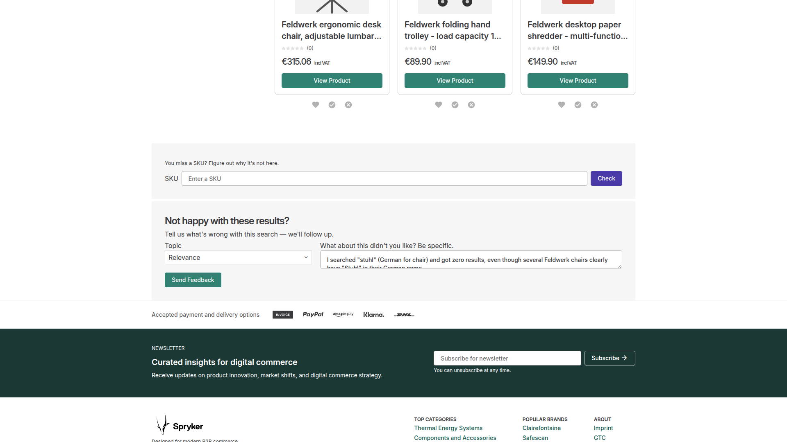
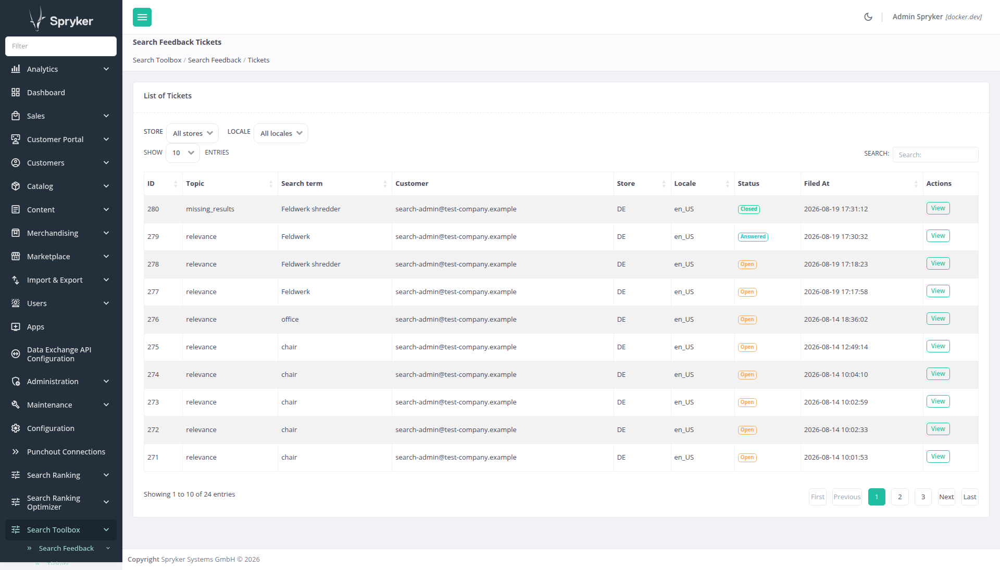

# Spryker Search Feedback

A voice-of-customer capture tool for the search results page (SRP): an authorized storefront customer can
file a free-text ticket about a set of search results — tied to the query term, active filters, page
number, and the SKUs actually shown on that page, plus a topic — and Zed back-office admins hold a
conversation about it from there. The Yves side is write-only: once a ticket is submitted there is no way
to read it, or any reply, back from the storefront. Everything past submission happens in Zed.

*Part of the [Search Relevance](https://search-relevance.dev/) project.*

## Contents

- [Why a separate package](#why-a-separate-package)
- [Status](#status)
- [What it does](#what-it-does)
- [Requirements](#requirements)
- [Installation](#installation)
- [Limitations](#limitations)
- [Testing and CI](#testing-and-ci)
  - [Automated checks](#automated-checks)
  - [Test suite](#test-suite)
  - [Known coverage gaps](#known-coverage-gaps)
  - [Browser (Presentation) suite](#browser-presentation-suite)
- [License](#license)

## Why a separate package

Structurally close to [spryker-community/search-ranking-optimizer](https://github.com/andrebarthelmeshellmuth/spryker-search-ranking-optimizer)'s
SRP relevance-rating widget (Yves widget → Gateway-controller write → Zed persistence), but a different
bounded context: this is qualitative support/VoC ticketing, not a numeric ranking signal. It has no
dependency on `search-ranking`/`search-ranking-optimizer`'s tuning machinery, and no dependency on
`search-debug`'s Elasticsearch `explain` internals — it only reads the query/filter/SKU state already on
the rendered SRP. Kept standalone so a shop can install it without either of those.

## Status

Feature-complete for its scope. Verified: 104 Codeception tests (Client, Zed, Zed GUI and Yves layers plus
both browser Presentation suites, including real-database integration coverage for the full submit → reply
→ status-change → list/find round trip), phpcs clean, and the package's public `SearchFeedbackFacade` at
100% method coverage. See [Testing and CI](#testing-and-ci) below for the measured numbers and the
(deliberate, documented) gaps.

## What it does

- **Yves**: a plain HTML form on the SRP (topic dropdown + free-text body), visible only to a customer
  holding `SubmitSearchFeedbackTicketPermissionPlugin`. Submitting redirects back to the SRP with a flash
  message — no AJAX, no new frontend component.
- **Zed**: a ticket grid + per-ticket conversation thread. Any Zed admin with access to the module can view
  every ticket and reply; changing a ticket's status (open/answered/closed) is its own controller action so
  it can be independently restricted to a "ticket worker" ACL group, leaving a "feedback admin" group able
  to view and reply but not triage. There is no per-submitter row-level scoping — Zed users and Yves
  customers are separate identity systems with no built-in link, so both Zed roles see the same full list.
  The grid has an optional Store/Locale filter (two dropdowns, "all" by default — this is a cross-scope
  triage view, not a per-market page); the ticket detail page shows the customer's email (resolved from
  their customer reference, cached per page load) instead of the raw reference, and a "View search results"
  link that reconstructs the exact SRP the ticket was filed from, in either dynamic-store-mode configuration.

The SRP ticket form (rendered below the product grid, outside the filter form — see step 5), the Zed
ticket grid (List of Tickets, sortable/searchable via DataTables), and a ticket's detail page (context +
full conversation thread + reply form + status actions):






## Requirements

- PHP >= 8.3
- Spryker (kernel/gui/acl/customer/company-user/store/permission-extension/propel-orm/transfer/user/
  zed-request — see `composer.json` for floors, verified by `composer check-floors`)
- **No search engine required.** Unlike the sibling `search-debug`/`search-ranking`/
  `search-ranking-optimizer` packages, this one never queries Elasticsearch/OpenSearch — a ticket only
  *records* the query/filters/page/SKUs a customer was looking at, it never re-runs or re-scores that
  search. Propel/MySQL is the only datastore.
- **B2B company-user accounts.** `CompanyUserPermissionAuthorizer` resolves "does this customer actually
  hold `SubmitSearchFeedbackTicketPermissionPlugin`" via their active `CompanyUser`, the same
  permission-granting mechanism the rest of a B2B shop already uses (same posture as the sibling
  `search-ranking-optimizer` package's own rating-permission check). A B2C-only shop with no
  `CompanyUser` module has nothing to grant the permission to.

## Installation

1. `composer require spryker-community/search-feedback`
2. Register the `SprykerCommunity` core namespace: add it to `KernelConstants::CORE_NAMESPACES` in
   `config/Shared/config_default.php`. Spryker's `ClassResolver` only ever looks in the project namespace
   plus whatever's listed here — miss this and every class in the package fails to resolve, most visibly as
   `Can not resolve `SearchFeedbackFacade` in Business layer for your module `SearchFeedback`` the moment
   anything tries to use the facade, even though composer installed the package correctly and every
   DependencyProvider below is wired up right.
   ```php
   $config[KernelConstants::CORE_NAMESPACES] = [
       // ... existing entries
       'SprykerCommunity',
   ];
   ```
3. Register `Pyz\Client\SearchFeedback\SearchFeedbackDependencyProvider`,
   `Pyz\Yves\SearchFeedbackWidget\SearchFeedbackWidgetDependencyProvider`,
   `Pyz\Zed\SearchFeedback\SearchFeedbackDependencyProvider`, and
   `Pyz\Zed\SearchFeedbackGui\SearchFeedbackGuiDependencyProvider` as project-level overrides of the
   package's own.
4. Register `SubmitSearchFeedbackTicketPermissionPlugin` in both the Client and Zed
   `PermissionDependencyProvider::getPermissionPlugins()`, and grant it to whichever company role should
   see the SRP ticket form (via `company_role_permission.csv` or the Company Role GUI).
5. Register `SearchFeedbackWidgetRouteProviderPlugin` in the Yves `RouterDependencyProvider` and
   `SearchFeedbackWidgetTwigPlugin` in the Yves `TwigDependencyProvider`.
6. Include the ticket-form view in your SRP template, gated on `canSubmitSearchFeedbackTicket()`.
   **It must render OUTSIDE any enclosing `<form>` your SRP template already has** (e.g. the catalog
   page's own filter/sort/pagination form). HTML doesn't allow nested forms — the browser silently drops
   the inner one, and clicking submit posts the OUTER form instead (wrong endpoint, wrong fields, no CSRF
   validation). Confirmed live: this exact breakage, when the include first landed inside that form.

   **Building `submitUrl` under `SPRYKER_DYNAMIC_STORE_MODE=1`.** If your shop runs with dynamic store
   mode enabled, don't pass `path('search-feedback-widget/submit-ticket')` straight into the molecule's
   `submitUrl` — route generation fails for any non-default store with `RouteNotFoundException: None of
   the chained routers were able to generate route: 'search-feedback-widget/submit-ticket' not found`,
   even though the exact same route matched fine on the way in.
   `StorePrefixRouterEnhancerPlugin::afterMatch()` only returns matched request *attributes*; it never
   calls `RequestContext::setParameter('store', ...)`, so generation has no store to work with for any
   route this package (or any other community package) registers. Build the URL by hand from the current
   request instead:
   ```twig
   
   
   {% include molecule('search-feedback-ticket-form', 'SearchFeedbackWidget') with {
       data: {
           canSubmit: canSubmitSearchFeedbackTicket(),
           searchTerm: data.searchString,
           pageNumber: data.pagination.currentPage | default(1),
           skuList: data.products | default([]) | map((product) => product.abstract_sku),
           csrfToken: searchFeedbackTicketCsrfToken(),
           submitUrl: storePrefix ~ '/search-feedback-widget/submit-ticket',
           topics: getSearchFeedbackTicketTopics(),
       },
   } only %}
   ```
   Verified against `/DE/...`, `/AT/...`, and no-prefix requests — all resolve to the correct `action` URL.
   Shops that don't run dynamic store mode can use `path()` directly and skip this.
7. Copy the `<search-feedback-gui>` block from this package's `Communication/navigation.xml` into your
   project's `config/Zed/navigation.xml`. If your project already lists every top-level Zed nav group
   explicitly (rather than relying on Spryker's default full-merge, i.e. `ZedNavigationConfig::
   getMergeStrategy()` returns `BREADCRUMB_MERGE_STRATEGY`), a brand-new top-level group silently never
   renders — nest the block as a `<pages>` entry inside an existing top-level group instead (e.g.
   `merchandising`, next to the sibling `search-preferences` entry). In that case **don't** also copy the
   package's own `<search-feedback-tickets>`/`<search-feedback-ticket-detail>` children into your root
   file — leave your root entry childless and let them merge in automatically from the package's own
   `navigation.xml`. Redeclaring them yourself causes `array_merge_recursive` to collide on the duplicate
   scalar leaves (same key, same string value) and turn them into arrays, which crashes the page with
   `Twig\Error\RuntimeError: ... ("Array to string conversion") in "@Gui/Partials/navigation.twig"`.
   Then run `console navigation:cache:remove` + `console navigation:build-cache` to pick up the change —
   the Zed nav tree is cached and does not re-read `navigation.xml` on every request.
8. **Warm the Zed Backoffice router cache**: `console router:cache:warm-up:backoffice`. Zed's nav renderer
   drops any item whose navigation-XML key isn't found in the *cached* Backoffice route collection
   (`BackofficeNavigationItemCollectionRouterFilter`) — with a stale cache the "Search Feedback" entry from
   step 7 is silently missing from the sidebar (no error, no log, it just isn't there) even though the
   page itself is reachable by typing the URL directly. Easy to miss because every *other* Zed page keeps
   working; only a newly-added bundle's own nav entry is affected.
9. Run `console transfer:generate`, `console propel:diff` + `console propel:migrate` (not
   `propel:sql:insert` — that reapplies the full schema dump), `console propel:model:build`, and
   `console dev:ide-auto-completion:generate`. `propel:model:build` is easy to skip since neither `diff` nor
   `migrate` builds PHP classes, only the database schema — missing it surfaces as `Class
   "Orm\Zed\SearchFeedback\Persistence\SpySearchFeedbackTicketQuery" not found` the first time anything
   touches the ticket table.
10. Warm up the Zed **BackendGateway** router: `console router:cache:warm-up:backend-gateway`. It's a
    separate cache from the Backoffice router's (step 8) — every other page can work fine while ticket
    submission alone 404s (`No route found for "POST .../search-feedback/gateway/submit-ticket"`) until
    this runs. Same gotcha the sibling `search-ranking-optimizer` package's own Gateway controller has.
    Also re-warm the **Yves** router cache — `yves router:cache:warm-up` — since step 5 adds a new Yves
    route; skipping it renders the SRP with a `RuntimeError: None of the chained routers were able to
    generate route: Route 'search-feedback-widget/submit-ticket' not found` the moment the ticket-form
    include tries to build its `submitUrl`. Standard practice for any package that adds a Yves route, not
    unique to this one, but easy to forget mid-walkthrough since nothing points at it explicitly.
11. In the Zed ACL module, create your "ticket worker" and "feedback admin" groups and grant/deny access to
    `SearchFeedbackGui/Detail/changeStatus` accordingly — this package ships no ACL fixture data.
12. **Translations.** Two separate mechanisms, one per layer — Zed's `trans` filter does **not** read from
    the Yves-facing Glossary module, same split as the sibling `search-ranking`/`search-ranking-optimizer`
    packages:
    - **Zed GUI** (ticket list/detail, reply form, status labels): ships as
      `spryker/translator` CSV catalogs under [`data/translation/Zed/`](data/translation/Zed/). If your
      project already extended `Pyz\Zed\Translator\TranslatorConfig::getCoreTranslationFilePathPatterns()`
      with the `spryker-community/*` glob for a sibling package, this package is auto-discovered by the
      same glob — no extra step. Otherwise add it once:
      ```php
      $coreTranslationFilePathPatterns[] = APPLICATION_VENDOR_DIR . '/spryker-community/*/data/translation/Zed/[a-z][a-z]_[A-Z][A-Z].csv';
      ```
    - **Yves widget** (ticket form + the check-installation page below): a plain
      [`data/glossary.csv`](data/glossary.csv), imported the normal Spryker way (the same Redis-backed
      Glossary module every Yves-facing string in a Spryker shop already uses):
      ```bash
      vendor/bin/console data:import glossary
      ```
13. **Verify the installation.**
    ```bash
    vendor/bin/console search-feedback:check-installation
    ```
    Most of the steps above fail *silently* when missed — the ticket form simply never appears, or
    appears but 404s on submit, with nothing in any log to say why. This command checks the core
    namespace registration, that every plugin class is loadable, and that the ticket table is reachable
    (a real DB round trip — the fastest way to notice step 9 was skipped). It exits non-zero and names
    the remedy for whatever is wrong, and explicitly flags the Backend Gateway router cache (step 10) —
    the single most notorious silent-failure point, since every other Zed page keeps working while ticket
    submission alone 404s until it's warmed.

    It also reports whether anybody other than a root-style admin can reach this package's Zed pages. Zed
    access is deny-by-default outside a matching ACL rule, and a nav entry the current user has no rule for is
    filtered out of the sidebar entirely rather than 403ing — so on a shop with real restricted back-office
    roles, "nobody adjusted ACL" looks exactly like "the package was never installed". A default Spryker
    install needs nothing done here (`root_role` holds a total wildcard), which is why this is a **warning at
    most, never a failure**, and only when restricted roles exist and not one of them has a rule for this
    package's module. Restricting these pages to root-style admins is a perfectly ordinary choice; the command
    cannot know which roles you meant to grant, so it asks you to confirm rather than telling you to fix.

    It is explicit about its own blind spots: running in Zed, it never bootstraps the Yves DI container,
    so it cannot confirm the route/Twig plugins from step 5 or the template include from step 6 — it says
    so in its output.

    Register it in `src/Pyz/Zed/Console/ConsoleDependencyProvider.php`:
    ```php
    use SprykerCommunity\Zed\SearchFeedback\Communication\Console\SearchFeedbackCheckInstallationConsole;

        protected function getConsoleCommands(Container $container): array
        {
            return [
                // ... existing commands
                new SearchFeedbackCheckInstallationConsole(),
            ];
        }
    ```

    **Yves-side counterpart.** `/search-feedback-widget/check-installation` closes exactly the gap the
    console command names above — it runs from inside the real Yves DI container (no new plugin
    registration needed, it uses the same `SearchFeedbackWidgetRouteProviderPlugin` from step 5), and
    checks the three Twig functions and the submit-ticket route from step 5. It is complementary, not a
    replacement: it does not re-check the core namespace, plugin class loadability, or the ticket table —
    run the console command for those.

    Reachable only when BOTH hold:
    - The route exists at all — governed by
      `SprykerCommunity\Shared\SearchFeedback\SearchFeedbackConstants::IS_CHECK_INSTALLATION_PAGE_ENABLED`,
      which **defaults to disabled**, same posture and same rationale as the identical flag on the
      sibling `search-debug` package. **Enable it in your development-tier config**:
      ```php
      $config[SearchFeedbackConstants::IS_CHECK_INSTALLATION_PAGE_ENABLED] = true;
      ```
    - The visiting customer holds the `SubmitSearchFeedbackTicketPermissionPlugin` permission — checked
      wherever the flag above leaves the route enabled. Missing the permission there renders a dedicated
      explanation with the exact remedy (grant the permission, per step 4) at HTTP 403, rather than a bare
      access-denied response.

## Limitations

- **No notification when a ticket is answered.** There is no email/mail integration anywhere in this
  package — a Zed admin's reply lands in the database and nowhere else. Combined with the Yves side being
  write-only (see above), a customer who filed a ticket has no way to ever learn it was answered unless
  told through some other channel. Deliberate scope: adding notifications means picking a channel
  (email? a storefront inbox widget, which would also mean building the read-back path this package
  intentionally doesn't have?) that's a real product decision, not a default this package should assume.
- **No per-submitter scoping in Zed.** Any Zed admin with access to the module sees every ticket from
  every customer — Zed users and Yves customers are separate identity systems with no built-in link, so
  there's no natural "your tickets" boundary to enforce even if it were wanted. Access control here is
  role-level (ticket worker vs. feedback admin, via the two separately-restrictable controller actions),
  not row-level.
- **One flat conversation thread per ticket, no internal/private notes.** Every message on a ticket —
  customer or Zed admin — is visible to any Zed admin who can view the ticket. There's no way for one Zed
  admin to leave a note for another without the customer's original message context, since there's no
  customer-facing view to accidentally leak an internal note into anyway; the constraint here is purely
  "everyone with access sees everything," not a security boundary between Zed users.

## Testing and CI

### Automated checks

`.github/workflows/ci.yml` runs on every push and pull request:

| check | what it protects |
|---|---|
| `composer validate` | the manifest stays well-formed |
| `phpcs` (PHP 8.3, 8.4) | coding standard, via this package's own `phpcs.xml` |
| `composer check-floors` (PHP 8.3, 8.4) | the declared dependency floors are real |
| `rector` dry-run (PHP 8.3, 8.4) | no unapplied Rector rule set drifts in |
| `phpmd` (`phpmd.xml` + `phpmd-public-methods.xml`) | cyclomatic/NPath complexity, method/class length stay reasonable — run as two separate invocations because PHPMD merges every loaded ruleset's `exclude-pattern` into one global file list per run, and only the public-method-count rule should skip Facades/Factories |
| `portable tests` (PHP 8.3, 8.4) | this package's own `@group Portable` test subset actually passes — see "Test suite" below |

Same `check-floors` rationale as the sibling `search-debug`/`search-ranking` packages: this package's
`require` constraints are a promise about which Spryker versions an adopter may install, which a full demo
shop's dependency tree cannot itself verify. `composer check-floors` resolves every constraint to its
oldest allowed version and asserts every vendor symbol `src/` references still exists there.

### Test suite

Every test class carries a portability `@group`, so `codecept run -g <tag>` tells you what a given test
actually needs:

| tag | needs | where it runs |
|---|---|---|
| `Portable` | nothing beyond `Generated\Shared\Transfer\*` | standalone — CI runs exactly this, see below |
| `NeedsDatabase` | a real Propel connection | host shop only |
| `NeedsProject` | Codeception's project-only actor/module stack, or this package's own installation diagnostics — see their own docblocks | host shop only |

This package never touches Elasticsearch/OpenSearch at all, so unlike its sibling packages there is no
`NeedsSearch` tag here.

`Portable` tests run standalone in CI on every push, via `tests/codeception.portable.yml` +
`tests/_ci-standalone/` — no host shop, no live database. The recipe: a direct `TransferBusinessFactory`
call generates `Generated\Shared\Transfer\*` into `src/Generated/` (gitignored, exactly like a real project
already gitignores its own — regenerated every run), bypassing the full Zed Console/Kernel bootstrap and
Locator entirely. Run it yourself the same way CI does:

```bash
composer install
php tests/_ci-standalone/generate-transfers.php
vendor/bin/codecept run -c tests/codeception.portable.yml -g Portable
```

The rest of the suite — `NeedsDatabase`/`NeedsProject` — ships under `tests/SprykerCommunityTest/`, one
per layer, and runs **inside a host shop** (they use the host's test bootstrap and, for the Zed suites, a
live Propel/MySQL connection):

```bash
vendor/bin/codecept build -c vendor/spryker-community/search-feedback/tests/SprykerCommunityTest/Client/SearchFeedback
vendor/bin/codecept run   -c vendor/spryker-community/search-feedback/tests/SprykerCommunityTest/Client/SearchFeedback
vendor/bin/codecept run   -c vendor/spryker-community/search-feedback/tests/SprykerCommunityTest/Zed/SearchFeedback
vendor/bin/codecept run   -c vendor/spryker-community/search-feedback/tests/SprykerCommunityTest/Zed/SearchFeedbackGui
vendor/bin/codecept run   -c vendor/spryker-community/search-feedback/tests/SprykerCommunityTest/Yves/SearchFeedbackWidget
```

86 tests in this table, plus 18 more in the two browser Presentation suites below (104 total), all green:

| layer | tests | notable coverage |
|---|---|---|
| Client | 8 | `SearchFeedbackClient`, `SearchFeedbackFactory`, `SearchFeedbackStub`, `SearchFeedbackConfig`, permission plugin — 100% methods |
| Zed (`SearchFeedback`) | 38 | `SearchFeedbackFacade` 100% (5/5), `TicketManager` 100%, `SearchFeedbackEntityManager`/`Repository`/`Mapper` 100%, `CompanyUserPermissionAuthorizer` 100%, `GatewayController` 100%, `SearchFeedbackCheckInstallationConsole` 100% (every check's pass/fail branch, via a mocked Facade + `CommandTester`) |
| Zed (`SearchFeedbackGui`) | 25 | `ReplyForm` validation (via a real Symfony `FormFactory`), `SearchFeedbackGuiCommunicationFactory` DI wiring (all 7 `get*()`/`create*()` methods), `TicketTable::configure()`/`resolveCustomerEmail()`, `DetailController::resolveCustomerEmail()`/`buildSearchResultsPageUrl()` (both dynamic-store-mode branches, against this shop's real config), `IndexController::resolveStoreName()`/`resolveLocaleName()` |
| Yves (`SearchFeedbackWidget`) | 15 | `SearchFeedbackWidgetFactory` DI wiring, `CheckInstallationController` 100% (permission gate, both Twig-function/route check branches, against a hand-built `ContainerInterface` fixture — no real app boot needed) |

The Zed suite's `GatewayControllerTest` and `SearchFeedbackFacadeTest` are real database integration
tests — no mocked Propel query builder — covering the full submit → reply → status-change →
list/find round trip through the actual Locator-resolved Facade, the same path `DetailController` and
`IndexController` drive in production. `CompanyUserPermissionAuthorizerTest` and `GatewayControllerTest`
together prove the authorization gate actually blocks unauthorized writes (persists nothing), not just
that it decorates the response — mirroring the equivalent tests in the sibling
`search-ranking-optimizer` package, which this module's own `CompanyUserPermissionAuthorizer` is a direct,
deliberate copy of.

### Known coverage gaps

Three classes are **not** exercised beyond a DI-wiring smoke test, and this is a structural limitation of
testing Communication/Yves-layer classes outside a live HTTP request — not an oversight:

- **`SearchFeedbackGuiCommunicationFactory::createReplyForm()`**. It resolves the real Zed Silex
  `form.factory` application service, which only exists once the full Zed app is bootstrapped — confirmed
  empirically (`Call to a member function create() on null` under Codeception's `Environment` helper
  alone). The `ReplyForm` type it builds has full, dedicated coverage in `ReplyFormTest` via a real,
  standalone Symfony `FormFactory` instead.
- **`TicketTable::render()`/`fetchData()`/`formatStatus()`/`prepareData()`**. These resolve the request and
  Twig environment from the Zed application container the same way `getFormFactory()` does — same
  limitation, same reason no sibling package (`search-debug`, `search-ranking`, `search-ranking-optimizer`)
  tests a `Table` class's full render path either. `configure()` and `resolveCustomerEmail()` (the rest of
  its real logic — header/sortable/searchable config, the store/locale URL-param baking, the customer-email
  N+1 lookup and its not-found fallback) have full, dedicated coverage instead, driven directly via
  Reflection (see `TicketTableTest`). The Twig-dependent remainder is verified live via the Presentation
  suite's `TicketGridAndDetailCest`/`StoreLocaleFilterCest`: status badge CSS class mapping, the per-row
  "View" action link, and the Store/Locale filter dropdowns all render and round-trip correctly.
- **`DetailController::indexAction()`/`IndexController::indexAction()`/`tableAction()`/
  `changeStatusAction()`**. Same limitation for the same reason — they resolve `createReplyForm()`/
  `createTicketTable()->render()`/`fetchData()`. Their non-framework-coupled logic
  (`resolveCustomerEmail()`, `buildSearchResultsPageUrl()`, `resolveStoreName()`, `resolveLocaleName()`) is
  unit tested directly instead (see `DetailControllerTest`/`IndexControllerTest`); the full action methods
  are covered end-to-end by the Presentation suite.
- **`SubmitTicketController`** (Yves). Reaches through `PermissionAwareTrait::can()` (Spryker's global
  `Locator` singleton, no constructor seam to substitute a fake permission client) and the flash-message
  helpers on `AbstractController`, both of which need a bootstrapped Yves Silex app — the exact same
  documented limitation the sibling `search-debug` package accepts for its own
  `SearchDebugContextEventDispatcherPlugin::handleRequest()` permission-granted branch. The controller's
  own request-parsing helper (`buildRedirectParameters()`) and its collaborators (`SearchFeedbackClient`,
  `SearchFeedbackWidgetFactory`) are covered independently.

Static analysis (`phpstan`, level 8, config in [`phpstan.neon`](phpstan.neon)) is likewise run from a host
shop rather than in CI: it needs the generated `Generated\Shared\Transfer\*` classes and the shop's
`Ide/AutoCompletion` stub freshly regenerated.

```bash
vendor/bin/console dev:ide-auto-completion:generate
vendor/bin/phpstan clear-result-cache -c vendor/spryker-community/search-feedback/phpstan.neon
vendor/bin/phpstan analyse -c vendor/spryker-community/search-feedback/phpstan.neon vendor/spryker-community/search-feedback/src
```

### Browser (Presentation) suite

> **This suite is a development tool for this package's own reference demoshop — it is not something
> to install or run against YOUR shop.** It logs in as a real Zed user and as
> `search-admin@test-company.example` (Yves, the one account this demoshop's fixtures grant
> `SubmitSearchFeedbackTicketPermissionPlugin` to), submits and replies to real tickets against this
> demoshop's seeded catalog and store/locale scope. Point it at a different shop and most of it will
> simply fail on missing data, not on a real defect. It exists to catch UI regressions while developing
> this package, not as something adopters are expected to run.

Two suites, split by layer:

- `tests/SprykerCommunityTest/Zed/SearchFeedbackGuiPresentation/` — the ticket grid, detail page (context
  table + conversation thread), reply-and-auto-transition rules (a reply moves an Open ticket to Answered,
  never moves an Answered/Closed one), manual status changes in either direction (self-contained: restores
  whatever status it found), reply-body escaping (a `<script>`/`&`/`<b>` payload asserted to render as
  literal text, never executes), edge cases (unknown status value, nonexistent ticket id on both the
  change-status and detail routes — all redirect gracefully, never crash), the Store/Locale filter
  dropdowns (selecting a store reloads the grid with the right query string and shows the selection back as
  `selected`; the default "all" option applies no filter), and a plain-catalog-search regression check
  confirming a logged-out guest sees none of this package's or its siblings' UI.
- `tests/SprykerCommunityTest/Yves/SearchFeedbackWidgetPresentation/` — the SRP ticket form: a real
  submission that redirects back with the success flash message, client-side rejection of a blank body,
  and the permission gate (anonymous guest, logged-in customer without the role, and the permitted
  customer as the positive control).

```bash
vendor/bin/codecept build -c packages/spryker-community/search-feedback/tests/SprykerCommunityTest/Zed/SearchFeedbackGuiPresentation
vendor/bin/codecept run   -c packages/spryker-community/search-feedback/tests/SprykerCommunityTest/Zed/SearchFeedbackGuiPresentation
vendor/bin/codecept build -c packages/spryker-community/search-feedback/tests/SprykerCommunityTest/Yves/SearchFeedbackWidgetPresentation
vendor/bin/codecept run   -c packages/spryker-community/search-feedback/tests/SprykerCommunityTest/Yves/SearchFeedbackWidgetPresentation
```

Like the rest of the test suite, neither is part of CI — both need a real running shop plus the Selenium/
chromedriver service already provisioned in this demoshop's `docker-compose.yml`.

## License

MIT — see [LICENSE](LICENSE).
